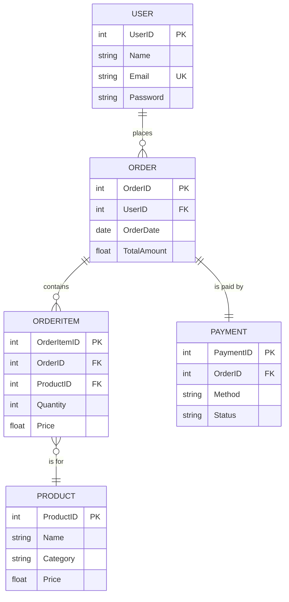
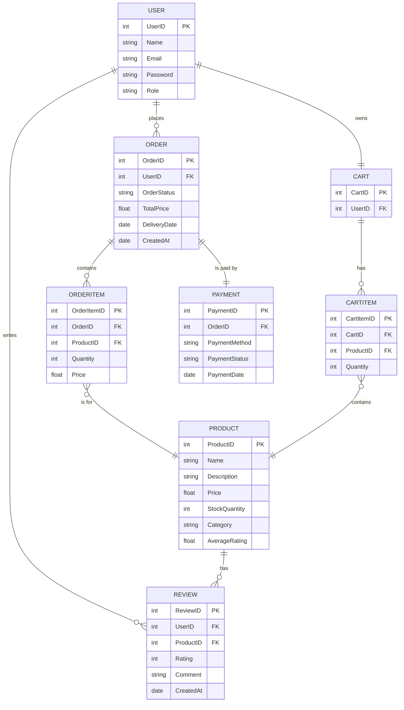

### **Practical Guide to Designing ERDs: From Requirements to a Functional Database**

Designing Entity-Relationship Diagrams (ERDs) for complex systems like HRMS or e-commerce platforms requires a structured approach. This guide provides practical steps, tips, and tricks to translate requirements into a robust ERD.

---

### **1. Understand and Document Requirements**

- **Engage Stakeholders**:

  - Interview stakeholders to gather functional and non-functional requirements.
  - Identify relationships, workflows, and edge cases.

- **Break Down Requirements**:
  - List the system's key functionalities.
  - Identify entities (objects) and actions (relationships).
- **Complex Scenarios to Consider**:
  - Multi-role assignments (e.g., matrix hierarchy).
  - Location-specific rules (e.g., taxes, public holidays).
  - Calculated fields (e.g., total salary, average ratings).

---

### **2. Identify Entities and Attributes**

- **Define Core Entities**:

  - Think of nouns in your requirements as potential entities (e.g., Employee, Product, Order).
  - Create a comprehensive list of objects relevant to the domain.

- **Assign Attributes to Entities**:

  - Attributes are properties of an entity (e.g., Employee Name, Salary).
  - Use atomic attributes to avoid redundancy (e.g., separate Full Name into First and Last Name).

- **Use Keys**:
  - Define primary keys (unique identifier for each entity).
  - Add foreign keys to establish relationships between entities.

---

### **3. Establish Relationships**

- **Define Relationships**:

  - Identify how entities interact (e.g., "Employee works in Department").
  - Classify relationships:
    - **1:1**: One-to-one (e.g., Employee ↔ Payroll).
    - **1:N**: One-to-many (e.g., Department ↔ Employees).
    - **N:M**: Many-to-many (e.g., Employees ↔ Projects).

- **Resolve N:M Relationships**:
  - Use a junction table (e.g., RoleAssignment table for Employee ↔ Department).

---

### **4. Normalize the Data**

Normalization ensures data consistency and reduces redundancy:

- **1NF** (First Normal Form):

  - Ensure each attribute contains atomic values.
  - Remove repeating groups.

- **2NF** (Second Normal Form):

  - Ensure all attributes depend on the entire primary key.

- **3NF** (Third Normal Form):
  - Remove transitive dependencies (non-key attributes should not depend on other non-key attributes).

**Example**:
If `Payroll` has `BaseSalary`, `Tax`, and `NetPay`:

- **Keep Tax as a separate entity** if tax rules change dynamically.
- Avoid storing `NetPay`—calculate it using:
  ```sql
  NetPay = BaseSalary - Tax + Bonus
  ```

---

### **5. Handle Complex Cases**

Complex systems often introduce edge cases that require thoughtful design:

#### **Case 1: Multi-Role Assignments**

- **Problem**: Employees can work in multiple departments with different roles.
- **Solution**:
  - Create a `RoleAssignment` table:
    - Attributes: `RoleAssignmentID`, `EmployeeID`, `DepartmentID`, `Role`, `StartDate`, `EndDate`.

#### **Case 2: Calculated Fields**

- **Problem**: Fields like `AverageRating` or `NetPay` are derived.
- **Solution**:
  - Avoid storing these values.
  - Use queries to calculate them dynamically for accuracy.

#### **Case 3: Dynamic Rules (e.g., Taxes, Leave Policies)**

- **Problem**: Rules vary by location or role.
- **Solution**:
  - Create rule-specific tables (e.g., `TaxRule`, `LeavePolicy`).
  - Link rules to entities using foreign keys.

---

### **6. Iterate with Stakeholders**

- **Review Initial Design**:

  - Present the ERD to stakeholders.
  - Verify that all requirements are covered.

- **Incorporate Feedback**:
  - Adjust relationships, attributes, or entities based on feedback.
  - Add edge cases or constraints as needed.

---

### **7. Validate the ERD**

- **Checklist**:

  - Is every entity uniquely identifiable (Primary Key)?
  - Are relationships properly defined (Foreign Keys)?
  - Have all N:M relationships been resolved?
  - Are calculated fields excluded from storage?
  - Have edge cases been addressed?

- **Simulate Workflows**:
  - Test CRUD operations (Create, Read, Update, Delete) for each entity.
  - Simulate complex workflows (e.g., leave approval, salary processing).

---

### **8. Optimize the Design**

- **Add Indexes**:

  - Index frequently queried fields (e.g., `EmployeeID`, `DepartmentID`).
  - Use composite indexes for join queries.

- **Partition Data**:

  - For large datasets, consider table partitioning (e.g., partition attendance records by year).

- **Use Constraints**:
  - Enforce data integrity with constraints:
    - **NOT NULL** for mandatory fields.
    - **UNIQUE** for email or username.
    - **CHECK** for valid ranges (e.g., `Rating BETWEEN 1 AND 5`).

---

### **9. Tools and Tips**

- **Use ERD Tools**:

  - **Online**: dbdiagram.io, Lucidchart, Draw.io.
  - **Database-Specific**: MySQL Workbench, SQL Server Management Studio.

- **Naming Conventions**:

  - Use meaningful names (e.g., `EmployeeID`, not `EmpID`).
  - Follow a consistent format (e.g., `CamelCase` or `snake_case`).

- **Modular Design**:

  - Break down the system into modules (e.g., HR, Payroll, Recruitment).
  - Design ERDs for each module and integrate them later.

- **Version Control**:
  - Track changes to your ERD design.
  - Use tools like Git for managing schema evolution.

---

### **10. Example Workflow**

#### **Requirements**:

An e-commerce platform requires:

- Users can purchase products.
- Products belong to categories.
- Orders track multiple products and payments.

#### **Entities**:

- `User`, `Product`, `Order`, `OrderItem`, `Payment`.

#### **ERD**:



---

### **Tips and Tricks**

- **Start Simple**: Begin with core entities and relationships.
- **Iterate**: Add complex relationships and constraints gradually.
- **Think Future-Proof**: Design with scalability and adaptability in mind.
- **Document Everything**: Include assumptions, workflows, and edge cases.
- **Validate Early**: Test with real-world data samples.

---

### **Scenario: E-Commerce Platform**

As a **Product Manager**, I need a database design for an e-commerce platform. Here's what the system should manage:

#### **Requirements:**

1. **Users**:

   - Customers can browse, purchase products, and leave reviews.
   - Admins manage products, orders, and users.
   - Each user has roles (Customer, Admin, or both).

2. **Products**:

   - Each product has details like name, price, description, category, stock quantity, and ratings.

3. **Orders**:

   - Customers place orders containing multiple products.
   - Track order status (Pending, Shipped, Delivered, Cancelled).
   - Each order should store the total price and delivery date.

4. **Reviews**:

   - Customers can leave reviews for products they’ve purchased, with ratings (1–5 stars) and comments.

5. **Shopping Cart**:

   - A temporary cart stores items customers add before checkout.

6. **Payments**:
   - Track payments for orders, including payment method (credit card, PayPal, etc.) and status (Successful, Failed).

---

### **Entities**:

1. **User**: Manages user details and roles.
2. **Product**: Manages product details.
3. **Order**: Stores order information.
4. **OrderItem**: Represents each product in an order.
5. **Review**: Tracks customer reviews for products.
6. **Cart**: Temporary storage of products added to a cart.
7. **Payment**: Handles payment details.

---

### **Relationships**:

1. **One user can place multiple orders**.
2. **Each order can have multiple products (OrderItems)**.
3. **One user can leave multiple reviews for different products**.
4. **A product can have multiple reviews**.
5. **A shopping cart belongs to one user**.
6. **One order corresponds to one payment**.

---

### **Your Task**:

1. Design an ERD that fulfills these requirements.
2. Normalize the database to at least 3rd Normal Form (3NF).
3. Handle complex cases like:
   - What happens if a user abandons their cart?
   - How do we track inventory changes when an order is placed or canceled?

---

Here's a detailed design for the ERD based on e-commerce requirements:

---

### **Entities and Attributes**

1. **User**

   - UserID (Primary Key)
   - Name
   - Email
   - Password
   - Role (Customer, Admin, or Both)

2. **Product**

   - ProductID (Primary Key)
   - Name
   - Description
   - Price
   - StockQuantity
   - Category
   - AverageRating (calculated field)

3. **Order**

   - OrderID (Primary Key)
   - UserID (Foreign Key from User)
   - OrderStatus (Pending, Shipped, Delivered, Cancelled)
   - TotalPrice
   - DeliveryDate
   - CreatedAt

4. **OrderItem**

   - OrderItemID (Primary Key)
   - OrderID (Foreign Key from Order)
   - ProductID (Foreign Key from Product)
   - Quantity
   - Price (Price at the time of purchase)

5. **Review**

   - ReviewID (Primary Key)
   - UserID (Foreign Key from User)
   - ProductID (Foreign Key from Product)
   - Rating (1–5 stars)
   - Comment
   - CreatedAt

6. **Cart**

   - CartID (Primary Key)
   - UserID (Foreign Key from User)

7. **CartItem**

   - CartItemID (Primary Key)
   - CartID (Foreign Key from Cart)
   - ProductID (Foreign Key from Product)
   - Quantity

8. **Payment**
   - PaymentID (Primary Key)
   - OrderID (Foreign Key from Order)
   - PaymentMethod (Credit Card, PayPal, etc.)
   - PaymentStatus (Successful, Failed)
   - PaymentDate

---

### **Relationships**

- A **User** can have multiple **Orders** (1:N).
- A **User** can leave multiple **Reviews** for different **Products** (1:N).
- A **Product** can have multiple **Reviews** (1:N).
- An **Order** can have multiple **OrderItems** (1:N).
- A **Cart** belongs to one **User** (1:1).
- A **Cart** can have multiple **CartItems** (1:N).
- Each **CartItem** is linked to a **Product** (1:N).
- Each **Order** is associated with one **Payment** (1:1).

---

### **Normalization to 3NF**

1. **1NF**: All attributes contain atomic values, and there are no repeating groups.
2. **2NF**: All non-key attributes are fully functionally dependent on the primary key.
3. **3NF**: Remove transitive dependencies (all non-key attributes depend only on the primary key).

---

### **Handling Complex Cases**

#### Abandoned Carts:

- **CartExpiration**: Introduce a timestamp in the Cart table to check when it was last updated. Periodically clear abandoned carts that haven't been updated for a specific duration.

#### Inventory Changes:

- **Order Placement**: When an order is placed, decrease the `StockQuantity` in the Product table based on the ordered quantity.
- **Order Cancellation**: If an order is canceled, increase the `StockQuantity` accordingly.

---

### **ERD Design Overview**

The ERD would look like this:

1. **User** connects to **Order**, **Review**, and **Cart**.
2. **Order** connects to **OrderItem** and **Payment**.
3. **OrderItem** connects to **Product**.
4. **Cart** connects to **CartItem**.
5. **CartItem** connects to **Product**.
6. **Review** connects to **User** and **Product**.

---

Here’s the **Mermaid** code for the ERD:



---

Here's my solution to the e-commerce platform ERD design as an expert. It incorporates all aspects of real-world complexities, optimizations, and practical constraints.

---

### **Final Solution**

#### **Entities and Attributes**

##### 1. `User`

- `UserID` (Primary Key)
- `Name`
- `Email` (Unique)
- `Password`
- `Role` (Customer, Admin, or Both)

##### 2. `Product`

- `ProductID` (Primary Key)
- `Name`
- `Description`
- `Price`
- `StockQuantity`
- `Category`
- `ImageURL` (to store product images)

##### 3. `Order`

- `OrderID` (Primary Key)
- `UserID` (Foreign Key)
- `OrderStatus` (Pending, Shipped, Delivered, Cancelled)
- `TotalPrice`
- `DeliveryDate`
- `CreatedAt`

##### 4. `OrderItem`

- `OrderItemID` (Primary Key)
- `OrderID` (Foreign Key)
- `ProductID` (Foreign Key)
- `Quantity`
- `Price` (Price at the time of purchase)

##### 5. `Review`

- `ReviewID` (Primary Key)
- `UserID` (Foreign Key)
- `ProductID` (Foreign Key)
- `Rating` (1–5 stars)
- `Comment`
- `CreatedAt`

##### 6. `Cart`

- `CartID` (Primary Key)
- `UserID` (Foreign Key, Unique)
- `LastUpdated`

##### 7. `CartItem`

- `CartItemID` (Primary Key)
- `CartID` (Foreign Key)
- `ProductID` (Foreign Key)
- `Quantity`

##### 8. `Payment`

- `PaymentID` (Primary Key)
- `OrderID` (Foreign Key, Unique)
- `PaymentMethod` (Credit Card, PayPal, etc.)
- `PaymentStatus` (Successful, Failed)
- `PaymentDate`

---

### **Key Considerations**

#### **Relationships**

1. **User ↔ Order**:
   - A user can have multiple orders, but an order belongs to one user.
   - 1:N relationship.
2. **Order ↔ OrderItem**:
   - An order can have multiple products, and each product's quantity and price are tracked.
   - 1:N relationship.
3. **OrderItem ↔ Product**:
   - A product can be part of multiple orders.
   - N:1 relationship.
4. **User ↔ Review ↔ Product**:
   - Users write reviews, and products have multiple reviews.
   - 1:N and N:1 relationships.
5. **User ↔ Cart ↔ CartItem ↔ Product**:
   - Each user has one cart, and each cart has multiple items. Items are linked to products.
   - 1:1, 1:N, and N:1 relationships.
6. **Order ↔ Payment**:
   - Each order is associated with exactly one payment.
   - 1:1 relationship.

#### **Handling Complexities**

1. **Abandoned Carts**:

   - Use `LastUpdated` in the `Cart` table.
   - Run a cron job or scheduled task to delete carts older than a threshold (e.g., 30 days).

2. **Inventory Updates**:

   - When an order is placed:
     - Reduce `StockQuantity` in `Product`.
   - When an order is canceled:
     - Revert the `StockQuantity`.
   - Use database triggers or application logic for consistency.

3. **Product Rating**:

   - Avoid storing `AverageRating` directly in the `Product` table.
   - Calculate dynamically using:
     ```sql
     SELECT AVG(Rating) FROM Review WHERE ProductID = ?
     ```

4. **Scalability**:
   - Ensure tables like `Product`, `Order`, and `Review` are indexed on key columns (e.g., `ProductID`, `UserID`).

---

### **ERD Design (Mermaid)**

```mermaid
erDiagram
    USER {
        int UserID PK
        string Name
        string Email UNIQUE
        string Password
        string Role
    }
    PRODUCT {
        int ProductID PK
        string Name
        string Description
        float Price
        int StockQuantity
        string Category
        string ImageURL
    }
    ORDER {
        int OrderID PK
        int UserID FK
        string OrderStatus
        float TotalPrice
        date DeliveryDate
        date CreatedAt
    }
    ORDERITEM {
        int OrderItemID PK
        int OrderID FK
        int ProductID FK
        int Quantity
        float Price
    }
    REVIEW {
        int ReviewID PK
        int UserID FK
        int ProductID FK
        int Rating
        string Comment
        date CreatedAt
    }
    CART {
        int CartID PK
        int UserID FK UNIQUE
        date LastUpdated
    }
    CARTITEM {
        int CartItemID PK
        int CartID FK
        int ProductID FK
        int Quantity
    }
    PAYMENT {
        int PaymentID PK
        int OrderID FK UNIQUE
        string PaymentMethod
        string PaymentStatus
        date PaymentDate
    }

    USER ||--o{ ORDER : "places"
    ORDER ||--o{ ORDERITEM : "contains"
    ORDERITEM }o--|| PRODUCT : "is for"
    USER ||--o{ REVIEW : "writes"
    PRODUCT ||--o{ REVIEW : "has"
    USER ||--|| CART : "owns"
    CART ||--o{ CARTITEM : "has"
    CARTITEM }o--|| PRODUCT : "contains"
    ORDER ||--|| PAYMENT : "is paid by"
```

---

### **Next Steps**

1. **Database Implementation**:
   - Create tables using SQL scripts based on the above attributes and relationships.
   - Implement indexes on primary keys, foreign keys, and frequently queried fields.
2. **Business Logic**:
   - Write procedures for handling orders, cart expiration, and stock updates.
3. **Testing**:
   - Test edge cases like simultaneous orders for the same product or abandoned carts.
4. **Optimization**:
   - Optimize database queries for reports, such as "most sold products" or "top-rated products."

---

Here’s a **HRMS** scenario that reflects real-world complexities like multi-department roles, multi-location operations, dynamic tax rules, and detailed performance tracking.

---

### **Scenario: Global HRMS with Advanced Features**

#### **Requirements**

1. **Employee Management**

   - Employees can have roles in multiple departments across different locations.
   - Employees may report to multiple managers (matrix structure).

2. **Dynamic Tax and Benefits**

   - Taxes and benefits vary by location, role, and salary tier.
   - Benefits include healthcare, retirement plans, and performance bonuses.

3. **Attendance and Shifts**

   - Employees work in shifts, which vary by department and location.
   - Support for remote work tracking (IP-based login, geolocation).

4. **Payroll with Multi-Currency Support**

   - Salaries are processed in local currencies and consolidated for global reporting.

5. **Leave Management**

   - Complex leave policies (e.g., carry-over, encashment, special leaves).
   - Support for location-specific public holidays.

6. **Recruitment and Onboarding**

   - Multi-round interviews with feedback and scores.
   - Automated onboarding with training schedules and document uploads.

7. **Performance Management**
   - Goal-based performance tracking with Key Performance Indicators (KPIs).
   - 360-degree feedback (peers, subordinates, and managers).

---

### **Entities and Attributes**

#### 1. `Employee`

- `EmployeeID` (Primary Key)
- `Name`
- `Email` (Unique)
- `Phone`
- `HireDate`
- `JobTitle`
- `Salary`
- `ManagerID` (Self-referencing Foreign Key)
- `LocationID` (Foreign Key)

#### 2. `Department`

- `DepartmentID` (Primary Key)
- `Name`
- `LocationID` (Foreign Key)

#### 3. `RoleAssignment`

- `RoleAssignmentID` (Primary Key)
- `EmployeeID` (Foreign Key)
- `DepartmentID` (Foreign Key)
- `Role`
- `StartDate`
- `EndDate`

#### 4. `Attendance`

- `AttendanceID` (Primary Key)
- `EmployeeID` (Foreign Key)
- `Date`
- `ShiftID` (Foreign Key)
- `LoginTime`
- `LogoutTime`
- `RemoteWork` (Boolean)

#### 5. `Shift`

- `ShiftID` (Primary Key)
- `DepartmentID` (Foreign Key)
- `ShiftName`
- `StartTime`
- `EndTime`

#### 6. `Payroll`

- `PayrollID` (Primary Key)
- `EmployeeID` (Foreign Key)
- `BaseSalary`
- `Currency`
- `Tax`
- `Benefits`
- `NetPay`
- `PayrollDate`

#### 7. `TaxRule`

- `TaxRuleID` (Primary Key)
- `LocationID` (Foreign Key)
- `SalaryRangeStart`
- `SalaryRangeEnd`
- `TaxPercentage`

#### 8. `LeavePolicy`

- `PolicyID` (Primary Key)
- `LocationID` (Foreign Key)
- `LeaveType` (e.g., Sick, Casual, Annual)
- `CarryOver` (Boolean)
- `MaxDays`
- `Encashable` (Boolean)

#### 9. `Leave`

- `LeaveID` (Primary Key)
- `EmployeeID` (Foreign Key)
- `PolicyID` (Foreign Key)
- `StartDate`
- `EndDate`
- `Status` (Pending, Approved, Rejected)

#### 10. `JobOpening`

- `JobID` (Primary Key)
- `Title`
- `Description`
- `DepartmentID` (Foreign Key)
- `LocationID` (Foreign Key)
- `Status` (Open, Closed)

#### 11. `Interview`

- `InterviewID` (Primary Key)
- `JobID` (Foreign Key)
- `CandidateName`
- `Round`
- `InterviewerID` (Foreign Key from `Employee`)
- `Feedback`
- `Score`

#### 12. `PerformanceReview`

- `ReviewID` (Primary Key)
- `EmployeeID` (Foreign Key)
- `ReviewerID` (Foreign Key from `Employee`)
- `ReviewDate`
- `KPIs`
- `Comments`
- `FeedbackType` (Self, Peer, Manager, Subordinate)

---

### **Relationships**

1. **Employee ↔ RoleAssignment**:

   - Employees can have multiple roles in different departments.
   - 1:N relationship.

2. **Employee ↔ Attendance ↔ Shift**:

   - Attendance is linked to shifts in specific departments.
   - N:1 relationship.

3. **Employee ↔ Leave ↔ LeavePolicy**:

   - Leave requests adhere to location-specific policies.
   - N:1 relationship.

4. **Employee ↔ Payroll ↔ TaxRule**:

   - Payroll depends on dynamic tax rules based on location and salary.
   - N:1 relationship.

5. **JobOpening ↔ Interview**:

   - Job openings have multiple interview rounds.
   - 1:N relationship.

6. **PerformanceReview ↔ Employee**:
   - Reviews can come from peers, subordinates, and managers.
   - N:1 relationship.

---

### **Complex Scenarios**

#### 1. **Multi-Location Role Management**

- Employees can work in multiple departments and locations.
- `RoleAssignment` tracks each role with start and end dates.

#### 2. **Dynamic Taxation**

- Tax rules vary by location and salary range.
- Example SQL for tax calculation:
  ```sql
  SELECT TaxPercentage
  FROM TaxRule
  WHERE LocationID = ?
  AND BaseSalary BETWEEN SalaryRangeStart AND SalaryRangeEnd;
  ```

#### 3. **Shift and Remote Work**

- `Attendance` tracks remote work with `RemoteWork`.
- Combine geolocation/IP tracking for accuracy.

#### 4. **360-Degree Feedback**

- `PerformanceReview` supports feedback from peers, subordinates, and managers.

#### 5. **Leave Encashment and Carry-Over**

- `LeavePolicy` includes `CarryOver` and `Encashable` fields.
- Example SQL for unused leave encashment:
  ```sql
  SELECT SUM(MaxDays - UsedDays)
  FROM LeavePolicy LP
  JOIN Leave L ON LP.PolicyID = L.PolicyID
  WHERE EmployeeID = ? AND Encashable = TRUE;
  ```

---

### **Mermaid ERD**

```mermaid
erDiagram
    EMPLOYEE {
        int EmployeeID PK
        string Name
        string Email UNIQUE
        string Phone
        date HireDate
        string JobTitle
        float Salary
        int ManagerID FK
        int LocationID FK
    }
    DEPARTMENT {
        int DepartmentID PK
        string Name
        int LocationID FK
    }
    ROLEASSIGNMENT {
        int RoleAssignmentID PK
        int EmployeeID FK
        int DepartmentID FK
        string Role
        date StartDate
        date EndDate
    }
    ATTENDANCE {
        int AttendanceID PK
        int EmployeeID FK
        date Date
        int ShiftID FK
        time LoginTime
        time LogoutTime
        boolean RemoteWork
    }
    SHIFT {
        int ShiftID PK
        int DepartmentID FK
        string ShiftName
        time StartTime
        time EndTime
    }
    PAYROLL {
        int PayrollID PK
        int EmployeeID FK
        float BaseSalary
        string Currency
        float Tax
        float Benefits
        float NetPay
        date PayrollDate
    }
    TAXRULE {
        int TaxRuleID PK
        int LocationID FK
        float SalaryRangeStart
        float SalaryRangeEnd
        float TaxPercentage
    }
    LEAVEPOLICY {
        int PolicyID PK
        int LocationID FK
        string LeaveType
        boolean CarryOver
        int MaxDays
        boolean Encashable
    }
    LEAVE {
        int LeaveID PK
        int EmployeeID FK
        int PolicyID FK
        date StartDate
        date EndDate
        string Status
    }
    JOBOPENING {
        int JobID PK
        string Title
        string Description
        int DepartmentID FK
        int LocationID FK
        string Status
    }
    INTERVIEW {
        int InterviewID PK
        int JobID FK
        string CandidateName
        int InterviewerID FK
        string Feedback
        int Score
    }
    PERFORMANCEREVIEW {
        int ReviewID PK
        int EmployeeID FK
        int ReviewerID FK
        date ReviewDate
        string KPIs
        string Comments
        string FeedbackType
    }

    EMPLOYEE ||--o{ ROLEASSIGNMENT : "assigned to"
    ROLEASSIGNMENT ||--o{ DEPARTMENT : "works in"
    DEPARTMENT ||--o{ SHIFT : "defines"
    EMPLOYEE ||--o{ ATTENDANCE : "records"
    ATTENDANCE ||--|| SHIFT : "belongs to"
    EMPLOYEE ||--o{ PAYROLL : "paid via"
    PAYROLL ||--|| TAXRULE : "follows"
    EMPLOYEE ||--o{ LEAVE : "requests"
    LEAVE ||--|| LEAVEPOLICY : "follows"
    EMPLOYEE ||--o{ PERFORMANCEREVIEW : "receives"
    PERFORMANCEREVIEW ||--|| EMPLOYEE : "given by"
    DEPARTMENT ||--o{ JOBOPENING : "posts"
    JOBOPENING ||--o{ INTERVIEW : "has"
```

---
